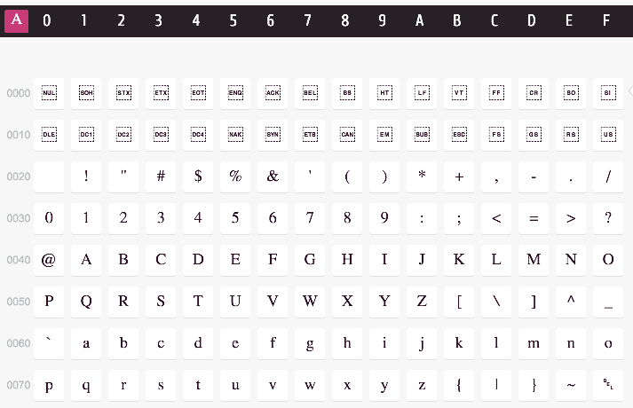

# Unicode

In our previous lesson we learned how ASCII created the bases for encodings. It quickly fell short, as 128 characters were not enough to represent every language out there, so new encodings started proliferating. The compatibility issues introduced by the usage of multiple encodings lead into the creation of a "Universal Standard": say hi to Unicode! 👋

Unicode is similar to ASCII and to the table we created in our lesson about Understanding Text, but with an important difference. For every symbol or character defined in Unicode, instead of specifying a particular sequence of bits, it assigns an abstract _code point_. **Unicode doesn't provide the actual bits in which the characters will be transformed**. You can think of Unicode as a step in between what we used to know as "_encoding_". The previous process (followed by our own table or by ASCII) was to assign a bit representation to every character: **character -> bit representation**. But Unicode will just assign an abstract and arbitrary _code point_. In order to get the final bits that we'll use in our computer (to store text in our disk, or send it through the network) we'll have to transform those _code points_ into actual bits, so the process ends up being: **character -> code point -> bit representation**.

To make it clear, Unicode will just provide that **character -> code point** part. It's just a table that specifies a character or symbol, and it's corresponding _code point_. At the moment of this writing, Unicode has more than 120,000 characters, and supports up to 1.1 million characters. It's a really big table. Here there's a stub of a table from [unicode-table.com](http://unicode-table.com/) that shows the first symbols:



For example, the character _A_ has the code point `0041`. Usually, when specifying code points we use the `U+` prefix, and we say that the code point is `U+0041`. We can also see this with Python:

```python
# Works both with Python 2 and Python 3
letter_A = u'A'  # We need the 'u' prefix if we're working in Python 2. Not needed in Py3.
decimal_A = ord(letter_A)  # 65 - Unicode code point position in decimal integer
hex_A = hex(decimal_A)  # '0x41' - Unicode code point in hexadecimal
```

If you want to create a unicode character directly specifying its code point you can use the `\u` form of string literals:

```python
# Works in both versions. u"" only required for Python 2.
print(u"\u0041")  # A
print(u"\U0001F601")  # 😁
```

Did you note that in the first example we used a lowercase 'u', while in the second example we used a capital 'U'? The difference resides in the position of the unicode character you want to express. If you want to express Unicode characters whose code points are between `U+0000` and `U+FFFF` you should use the lowercase 'u' notation (`'\u'`). That means basically all the characters above this special non-existent [character](http://unicode-table.com/en/#FFFF). If you want to express unicode characters whose code point is between `U+00010000` and beyond you must use the uppercase 'U'. As you can see with Python we can print a wide range of characters, including emojis as the [grinning face](http://unicode-table.com/en/#1F601) from above.
